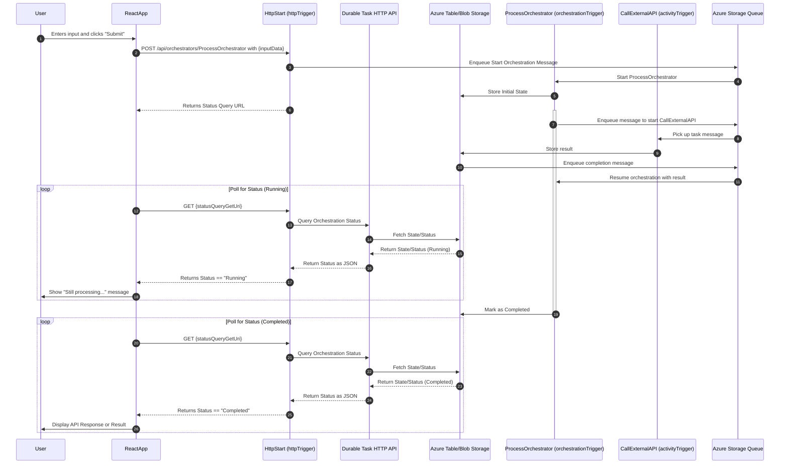

# Durable Functions Test App

This repository contains an Azure Durable Functions application with a React frontend.

## Sequence diagram



## Prerequisites

Before running this application locally, make sure you have the following installed:

- [Python 3.11](https://www.python.org/downloads/)
- [Node.js 20](https://nodejs.org/)
- [Azure Functions Core Tools v4](https://learn.microsoft.com/en-us/azure/azure-functions/functions-run-local?tabs=windows%2Cisolated-process%2Cnode-v4%2Cpython-v2%2Chttp-trigger%2Ccontainer-apps&pivots=programming-language-python#install-the-azure-functions-core-tools)
- [Visual Studio Code](https://code.visualstudio.com/) (recommended)
- [Azure Functions extension for VS Code](https://marketplace.visualstudio.com/items?itemName=ms-azuretools.vscode-azurefunctions) (optional)
- PowerShell 7 or WSL2

## Setup Instructions

### Setting Up the Backend (Azure Functions)

1. Open a terminal (PowerShell 7 or WSL2).
2. Navigate to the project root directory:
3. Create a Python virtual environment:
   ```
   python -m venv .venv
   ```
4. Activate the virtual environment:
   - **PowerShell 7**:
     ```
     .venv\Scripts\activate
     ```
   - **WSL2**:
     ```
     source .venv/bin/activate
     ```
5. Install the required Python packages:
   ```
   pip install -r requirements.txt
   ```

### Setting Up the Frontend (React)

1. Open a terminal (PowerShell 7 or WSL2).
2. Navigate to the frontend directory:
   ```
   cd frontend
   ```
3. Install the required npm packages:
   ```
   npm install
   ```

## Running the Application Locally

### Starting Azurite to serve as the emulator for Azure Storage

To install Azurite, you can use npm:

```bash
npm install -g azurite
```

To start Azurite, run:

```bash
azurite
```

### Starting the Azure Functions Backend

1. Ensure your virtual environment is activated:

   - **PowerShell 7**:
     ```
     .venv\Scripts\activate
     ```
   - **WSL2**:
     ```
     source .venv/bin/activate
     ```

   (If you're in the same terminal session from the setup steps, it should already be activated.)

2. In the project root directory, start the Azure Functions host:

   ```
   func start
   ```

   This will start the Azure Functions runtime locally, hosting your durable functions.

3. Note the URL where your HTTP trigger function is running.

### Starting the React Frontend

1. In a separate terminal, navigate to the frontend directory:

   ```
   cd frontend
   ```

2. Start the React development server:

   ```
   npm start
   ```

3. Your default browser should automatically open to http://localhost:3000, showing the frontend application.

## Deploying to Azure

### Deploying the Azure Functions Backend

1. Create Azure resources using the Bicep template in the repository:

   ```powershell
   # Define variables
   $RESOURCE_GROUP="rg-durable-functions-test"
   $LOCATION="japaneast"
   $FUNCTION_APP_NAME="func-durable-app"
   $APP_SERVICE_PLAN="plan-durable-app"
   $APP_INSIGHTS_NAME="appi-durable-app"
   ```

   To generate a random storage account name:

   - **For PowerShell 7**: Use the following command:

     ```powershell
     $STORAGE_ACCOUNT_NAME="stdurableapp$((Get-Random -Maximum 999).ToString('000'))"
     ```

   - **For WSL2**: Use the following command:
     ```bash
     STORAGE_ACCOUNT_NAME=$(printf "stdurableapp%03d" $((RANDOM % 1000)))
     ```

   ```powershell
   # Log in to Azure if not already logged in
   az login

   # Create a resource group
   az group create --name $RESOURCE_GROUP --location $LOCATION

   # Deploy the Bicep template
   az deployment group create \
     --resource-group $RESOURCE_GROUP \
     --template-file infra/main.bicep \
     --parameters functionAppName=$FUNCTION_APP_NAME \
                  storageAccountName=$STORAGE_ACCOUNT_NAME \
                  appServicePlanName=$APP_SERVICE_PLAN \
                  appInsightsName=$APP_INSIGHTS_NAME
   ```

   This will create all necessary resources:

   - Storage Account for the Function App
   - App Service Plan
   - Application Insights
   - Function App with proper configuration

2. Deploy the Function App using Azure Functions Core Tools:

   ```powershell
   # Deploy the function app
   func azure functionapp publish $FUNCTION_APP_NAME
   ```

3. After deployment, you can view the Function App URL in the outputs of the Bicep deployment or in the Azure portal:

   ```powershell
   # Get the function app URL
   $FUNCTION_APP_URL=$(az functionapp show --name $FUNCTION_APP_NAME --resource-group $RESOURCE_GROUP --query "defaultHostName" -o tsv)
   echo "Function App URL: https://$FUNCTION_APP_URL"
   ```

### Deploying the Frontend (React)

1. Build the production version of the React application:

   ```powershell
   # Navigate to frontend directory
   cd frontend

   # Build the React app
   npm run build
   ```

2. Deploy the built frontend using one of these methods:

   #### Option 1: Azure Static Web Apps

   ```powershell
   # Define variables
   $STATIC_WEB_APP_NAME="stapp-durable-frontend"

   # Create and deploy Static Web App
   az staticwebapp create \
     --name $STATIC_WEB_APP_NAME \
     --resource-group $RESOURCE_GROUP \
     --source https://github.com/yourusername/durable_test_app \
     --location "eastus2" \
     --branch main \
     --app-location "/frontend" \
     --output-location "build"
   ```

   #### Option 2: Azure Storage Static Website

   ```powershell
   # Define variables
   $STORAGE_WEB_NAME="stwebdurable$((Get-Random -Maximum 999).ToString('000'))"

   # Create storage account
   az storage account create \
     --name $STORAGE_WEB_NAME \
     --resource-group $RESOURCE_GROUP \
     --location $LOCATION \
     --sku Standard_LRS \
     --kind StorageV2

   # Enable static website feature
   az storage blob service-properties update \
     --account-name $STORAGE_WEB_NAME \
     --static-website \
     --index-document index.html

   # Upload the built files
   az storage blob upload-batch \
     --account-name $STORAGE_WEB_NAME \
     --source frontend/build \
     --destination '$web'

   # Get the static website URL
   $STATIC_WEBSITE_URL=$(az storage account show \
     --name $STORAGE_WEB_NAME \
     --resource-group $RESOURCE_GROUP \
     --query "primaryEndpoints.web" \
     --output tsv)
   echo "Static Website URL: $STATIC_WEBSITE_URL"
   ```

3. Update CORS settings in your Function App to allow the frontend domain:

   ```powershell
   # Add CORS origin for the static website
   az functionapp cors add \
     --name $FUNCTION_APP_NAME \
     --resource-group $RESOURCE_GROUP \
     --allowed-origins $STATIC_WEBSITE_URL
   ```

4. Update your frontend API configuration to use the Azure Function App URL:
   - In your React app, update API endpoints to point to your Function App URL
   - Example: `https://$FUNCTION_APP_URL/api/HttpStart`

## GitHub Actions Workflow Setup

This repository includes a GitHub Actions workflow that automatically deploys the application to Azure and runs end-to-end tests. To use this workflow when you fork this repository, follow these steps:

### Setting up AZURE_CREDENTIALS

1. **Create an App Registration in Microsoft Entra ID**:

   - Sign in to the [Azure Portal](https://portal.azure.com)
   - Navigate to **Microsoft Entra ID** > **App registrations**
   - Click **+ New registration**
   - Enter a name (e.g., "GitHubActionsDurableTest")
   - Select the appropriate supported account types (usually "Accounts in this organizational directory only")
   - Leave the Redirect URI blank
   - Click **Register**

2. **Create a Client Secret**:

   - In your newly created app registration, go to **Certificates & secrets**
   - Click **+ New client secret**
   - Add a description (e.g., "GitHub Actions")
   - Select an expiration period (choose a shorter period if required by your organization policy)
   - Click **Add**
   - **IMPORTANT**: Copy the secret value immediately as it won't be shown again

3. **Assign Role to the Service Principal**:

   - Navigate to **Subscriptions** in the Azure Portal
   - Select the subscription you want to use
   - Go to **Access control (IAM)**
   - Click **+ Add** > **Add role assignment**
   - Select the **Contributor** role
   - Click **Next**
   - Under **Assign access to**, select **Microsoft Entra user, group, or service principal**
   - Click **+ Select members**
   - Search for the app registration name you created earlier
   - Select it and click **Select**
   - Click **Review + assign**

4. **Prepare Credentials JSON**:

   - Create a JSON file with the following format:

   ```json
   {
     "clientId": "YOUR_APP_ID",
     "clientSecret": "YOUR_CLIENT_SECRET",
     "tenantId": "YOUR_TENANT_ID",
     "subscriptionId": "YOUR_SUBSCRIPTION_ID"
   }
   ```

   - Replace `YOUR_APP_ID` with the Application (client) ID from the app registration Overview page
   - Replace `YOUR_CLIENT_SECRET` with the secret value you copied in step 2
   - Replace `YOUR_TENANT_ID` with the Directory (tenant) ID from the app registration Overview page
   - Replace `YOUR_SUBSCRIPTION_ID` with the Subscription ID you want to use for deployments

   > **Note**: The Azure login action (azure/login@v2) expects the credentials in this format. If you're experiencing login issues, make sure all four parameters are included.

### Setting up GitHub Repository Secret

After getting your credentials JSON (from either Option 1 or Option 2):

1. Go to your GitHub repository
2. Click on **Settings** > **Secrets and variables** > **Actions**
3. Click on **New repository secret**
4. Set the name to `AZURE_CREDENTIALS`
5. Paste the entire JSON output as the value
6. Click **Add secret**

### Running the workflow

The workflow will automatically run on pushes to the `main` branch. You can also manually trigger it from the "Actions" tab in your GitHub repository.

## Testing the Application

Once both the backend and frontend are running:

1. Use the frontend interface to interact with the Durable Functions app
2. Alternatively, you can test the backend directly by sending HTTP requests to the HttpStart endpoint:
   ```
   http://localhost:7071/api/HttpStart  # For local testing
   https://my-durable-function-app.azurewebsites.net/api/HttpStart  # For Azure deployment
   ```

### Running End-to-End Tests Locally with Playwright

To manually run the E2E tests using Playwright on your Windows PC:

1. Make sure both the Azure Functions backend and the React frontend are running:

   - Backend should be running on http://localhost:7071
   - Frontend should be running on http://localhost:3000

2. Open a PowerShell 7 terminal in the project root directory

3. Install Playwright and its dependencies (if not already installed):

   ```powershell
   npm install -D @playwright/test
   npx playwright install --with-deps chromium
   ```

4. Run the Playwright tests:

   ```powershell
   npx playwright test
   ```

5. To run tests with a visible browser (non-headless mode), use:

   ```powershell
   npx playwright test --headed
   ```

6. To open the HTML report after test execution:
   ```powershell
   npx playwright show-report
   ```

## Troubleshooting

- **Port conflicts**: If another application is using port 7071 or 3000, you may need to configure different ports
- **CORS issues**: If you encounter CORS errors, check the Azure Functions local.settings.json file to ensure it has proper CORS settings
- **Python/Node version incompatibilities**: Ensure you're using compatible versions of Python and Node as listed in prerequisites
- **Azure deployment issues**: Check Azure Function logs in the portal or via `func azure functionapp logstream my-durable-function-app`

## Application Structure

- `host.json`: Configuration for the Azure Functions host
- `requirements.txt`: Python dependencies
- `frontend/`: Contains the React frontend application
- `HelloOrchestrator/`: The durable orchestrator function
- `HttpStart/`: HTTP trigger function to start the orchestration
- `SayHello/`: Activity function called by the orchestrator

# Recommended Reading

- https://learn.microsoft.com/en-us/azure/azure-functions/durable/durable-functions-http-api
- https://learn.microsoft.com/en-us/python/api/azure-functions-durable/azure.durable_functions.durableorchestrationclient?view=azure-python#azure-durable-functions-durableorchestrationclient-create-check-status-response
- https://github.com/Azure/azure-functions-durable-extension/issues/1026
