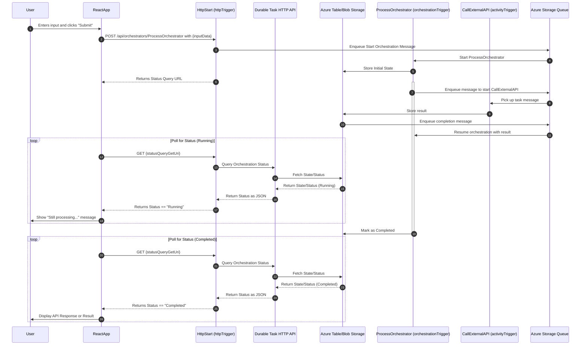

# Durable Functions Test App

This repository contains an Azure Durable Functions application with a React frontend.

## Sequence diagram



## Prerequisites

Before running this application locally, make sure you have the following installed:

- [Python 3.11](https://www.python.org/downloads/)
- [Node.js 20](https://nodejs.org/)
- [Azure Functions Core Tools v4](https://learn.microsoft.com/en-us/azure/azure-functions/functions-run-local?tabs=windows%2Cisolated-process%2Cnode-v4%2Cpython-v2%2Chttp-trigger%2Ccontainer-apps&pivots=programming-language-python#install-the-azure-functions-core-tools)
- [Visual Studio Code](https://code.visualstudio.com/) (recommended)
- [Azure Functions extension for VS Code](https://marketplace.visualstudio.com/items?itemName=ms-azuretools.vscode-azurefunctions) (optional)
- PowerShell 7

## Setup Instructions

### Setting Up the Backend (Azure Functions)

1. Open a PowerShell 7 terminal
2. Navigate to the project root directory:
3. Create a Python virtual environment:
   ```
   python -m venv .venv
   ```
4. Activate the virtual environment:
   ```
   .venv\Scripts\activate
   ```
5. Install the required Python packages:
   ```
   pip install -r requirements.txt
   ```

### Setting Up the Frontend (React)

1. Open a new PowerShell 7 terminal
2. Navigate to the frontend directory:
   ```
   cd frontend
   ```
3. Install the required npm packages:
   ```
   npm install
   ```

## Running the Application Locally

### Starting Azurite to serve as the emulator for Azure Storage
To install Azurite, you can use npm:
```bash
npm install -g azurite
```

To start Azurite, run:
```bash
azurite
```

### Starting the Azure Functions Backend

1. Ensure your virtual environment is activated:
   ```
   .venv\Scripts\activate
   ```
   (If you're in the same terminal session from the setup steps, it should already be activated)

2. In the project root directory, start the Azure Functions host:
   ```
   func start
   ```
   This will start the Azure Functions runtime locally, hosting your durable functions.

3. Note the URL where your HTTP trigger function is running

### Starting the React Frontend

1. In a separate terminal, navigate to the frontend directory:
   ```
   cd frontend
   ```

2. Start the React development server:
   ```
   npm start
   ```

3. Your default browser should automatically open to http://localhost:3000, showing the frontend application

## Deploying to Azure

### Deploying the Azure Functions Backend

1. Create an Azure Function App in the Azure portal or using Azure CLI:
   ```
   az group create --name myResourceGroup --location eastus
   az storage account create --name mystorageaccount --location eastus --resource-group myResourceGroup --sku Standard_LRS
   az functionapp create --resource-group myResourceGroup --consumption-plan-location eastus --runtime python --runtime-version 3.9 --functions-version 4 --name my-durable-function-app --storage-account mystorageaccount --os-type windows
   ```

2. Deploy the Function App using Azure Functions Core Tools:
   ```
   func azure functionapp publish my-durable-function-app
   ```

3. After deployment, configure application settings in the Azure portal:
   - Go to your Function App in the Azure portal
   - Navigate to Configuration > Application settings
   - Add necessary settings (if needed for your app)

### Deploying the Frontend (React)

1. Build the production version of the React application:
   ```
   cd frontend
   npm run build
   ```

2. Deploy the built frontend using one of these methods:
   
   #### Option 1: Azure Static Web Apps
   ```
   az staticwebapp create --name my-static-web-app --resource-group myResourceGroup --source https://github.com/yourusername/durable_test_app --location "eastus2" --branch main --app-location "/frontend" --output-location "build"
   ```
   
   #### Option 2: Azure Storage Static Website
   ```
   az storage account create --name mystaticwebsite --resource-group myResourceGroup --location eastus --sku Standard_LRS --kind StorageV2
   az storage blob service-properties update --account-name mystaticwebsite --static-website --index-document index.html
   az storage blob upload-batch --account-name mystaticwebsite --source frontend/build --destination '$web'
   ```

3. Update the API URL in your frontend production build to point to your Azure Function App URL before deploying

### Connecting Frontend and Backend in Azure

1. Enable CORS in your Function App:
   - Go to your Function App in the Azure portal
   - Navigate to CORS settings
   - Add the URL of your frontend deployment (e.g., https://my-static-web-app.azurestaticapps.net)

2. Update your frontend API configuration to use the Azure Function App URL:
   - In your React app, update API endpoints to point to your Function App URL
   - Example: `https://my-durable-function-app.azurewebsites.net/api/HttpStart`

## Testing the Application

Once both the backend and frontend are running:

1. Use the frontend interface to interact with the Durable Functions app
2. Alternatively, you can test the backend directly by sending HTTP requests to the HttpStart endpoint:
   ```
   http://localhost:7071/api/HttpStart  # For local testing
   https://my-durable-function-app.azurewebsites.net/api/HttpStart  # For Azure deployment
   ```

## Troubleshooting

- **Port conflicts**: If another application is using port 7071 or 3000, you may need to configure different ports
- **CORS issues**: If you encounter CORS errors, check the Azure Functions local.settings.json file to ensure it has proper CORS settings
- **Python/Node version incompatibilities**: Ensure you're using compatible versions of Python and Node as listed in prerequisites
- **Azure deployment issues**: Check Azure Function logs in the portal or via `func azure functionapp logstream my-durable-function-app`

## Application Structure

- `host.json`: Configuration for the Azure Functions host
- `requirements.txt`: Python dependencies
- `frontend/`: Contains the React frontend application
- `HelloOrchestrator/`: The durable orchestrator function
- `HttpStart/`: HTTP trigger function to start the orchestration
- `SayHello/`: Activity function called by the orchestrator

# Recommended Reading
- https://learn.microsoft.com/en-us/azure/azure-functions/durable/durable-functions-http-api
- https://learn.microsoft.com/en-us/python/api/azure-functions-durable/azure.durable_functions.durableorchestrationclient?view=azure-python#azure-durable-functions-durableorchestrationclient-create-check-status-response
- https://github.com/Azure/azure-functions-durable-extension/issues/1026
